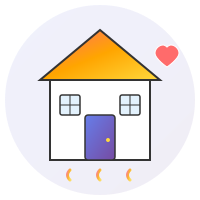

# Quick Start Guide

## Using the Logo

### In HTML
```html
<!-- Animated logo -->


<!-- Static logo -->

```

### Direct SVG Embed
```html
<div class="logo-container">
  <svg xmlns="http://www.w3.org/2000/svg" viewBox="0 0 200 200">
    <!-- SVG content from logo.svg -->
  </svg>
</div>
```

### As Background
```css
.header {
  background-image: url('logo.svg');
  background-size: contain;
  background-repeat: no-repeat;
  background-position: center;
}
```

## Using the Icons

### In HTML
```html
<!-- Standard usage -->


<!-- In buttons -->
<button class="cta-button">
  
  <span>Check In</span>
</button>
```

### All Available Icons
- `icons/register.svg` - Client registration
- `icons/checkin.svg` - Check in
- `icons/checkout.svg` - Check out
- `icons/services.svg` - Services
- `icons/resources.svg` - Resources
- `icons/emergency.svg` - Emergency (with animation)
- `icons/report.svg` - Reports
- `icons/settings.svg` - Settings (with animation)
- `icons/profile.svg` - Profile
- `icons/food.svg` - Food services
- `icons/shelter.svg` - Shelter
- `icons/medical.svg` - Medical (with animation)
- `icons/transport.svg` - Transport (with animation)
- `icons/support.svg` - Support (with animation)
- `icons/info.svg` - Information
- `icons/calendar.svg` - Calendar

## Using Animations

### Apply to Logo
```html

```

### Apply to Any Element
```html
<div class="fade-in">Content fades in</div>
<div class="slide-in">Content slides in</div>
<div class="loading">Loading spinner</div>
```

### Custom Animation
```css
.my-element {
  animation: float 3s ease-in-out infinite;
}
```

## Customizing Colors

### Change Icon Colors
Icons use gradients defined in their `<defs>` section. Edit the gradient stops:
```svg
<linearGradient id="myGrad" x1="0%" y1="0%" x2="100%" y2="100%">
  <stop offset="0%" style="stop-color:#YOUR_COLOR;stop-opacity:1" />
  <stop offset="100%" style="stop-color:#YOUR_COLOR;stop-opacity:1" />
</linearGradient>
```

### Change Theme Colors
Edit `styles.css`:
```css
:root {
  --primary-color: #667eea;
  --secondary-color: #764ba2;
  --accent-color: #FFD93D;
}
```

## Responsive Usage

### CSS for Different Screens
```css
/* Desktop */
.logo {
  width: 120px;
  height: 120px;
}

/* Tablet */
@media (max-width: 768px) {
  .logo {
    width: 100px;
    height: 100px;
  }
}

/* Mobile */
@media (max-width: 480px) {
  .logo {
    width: 80px;
    height: 80px;
  }
}
```

## Integration Examples

### React/JSX
```jsx
import logo from './logo.svg';
import registerIcon from './icons/register.svg';

function Header() {
  return (
    <header>
      
      <button>
        
        Register Client
      </button>
    </header>
  );
}
```

### Vue
```vue
<template>
  <header>
    
    <button>
      
      Register Client
    </button>
  </header>
</template>
```

### Angular
```typescript
@Component({
  selector: 'app-header',
  template: `
    <header>
      
      <button>
        
        Register Client
      </button>
    </header>
  `
})
```

## Performance Tips

1. **Use SVG Sprites** for multiple icons on same page
2. **Inline critical SVGs** to reduce HTTP requests
3. **Lazy load** icons below the fold
4. **Use CSS** instead of SVG animations when possible
5. **Optimize** with SVGO tool if needed
6. **Cache** SVG files with proper headers

## Accessibility

### Always Include Alt Text
```html


```

### Use ARIA Labels for Buttons
```html
<button aria-label="Check in client">
  
  <span>Check In</span>
</button>
```

### Add Roles When Needed
```html
<svg role="img" aria-label="Logo">
  <!-- SVG content -->
</svg>
```

## File Locations

```
project/
├── logo.svg              (Main logo)
├── icons/                (All icons)
│   ├── register.svg
│   ├── checkin.svg
│   └── ...
├── index.html            (Demo page)
├── styles.css            (All styles & animations)
└── script.js             (Interactive features)
```

## Browser Support

✅ Chrome/Chromium 90+
✅ Firefox 88+
✅ Safari 14+
✅ Edge 90+
✅ Mobile browsers (iOS 14+, Android 5+)

## Common Issues

### Icon Not Displaying
- Check file path is correct
- Verify file exists in `/icons` directory
- Check image src attribute

### Animation Not Working
- Ensure `animated` class is applied
- Check `styles.css` is loaded
- Verify CSS animations are supported

### Transparent Background Not Showing
- SVG backgrounds are transparent by default
- If you see white, it may be the container background
- Use browser dev tools to inspect

## Need Help?

Refer to:
- README.md - Full documentation
- CALL_TO_ACTIONS.md - CTA implementation ideas
- ADDITIONAL_SERVICES.md - Service integration ideas
- IMPLEMENTATION_SUMMARY.md - Project overview

## Examples in This Project

Open `index.html` in a browser to see:
- Logo with animations
- All 16 icons in use
- Responsive design
- Interactive buttons
- Notification system
- Icon gallery

Start here: `python3 -m http.server 8000` then visit `http://localhost:8000`
